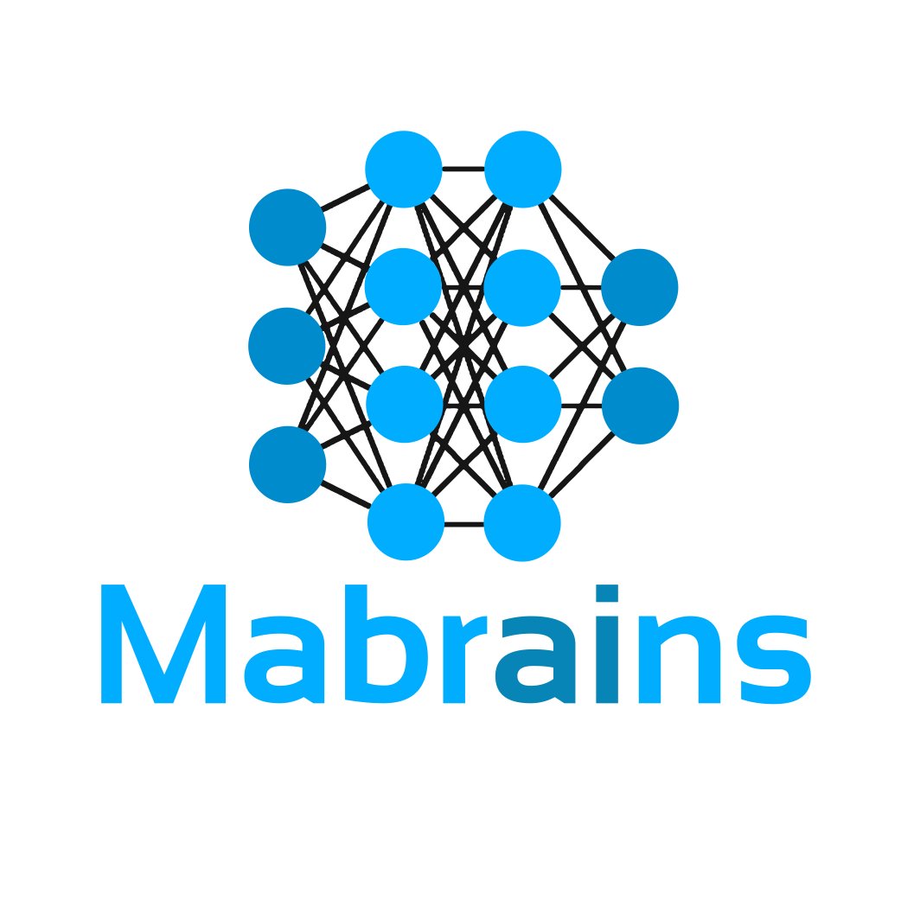
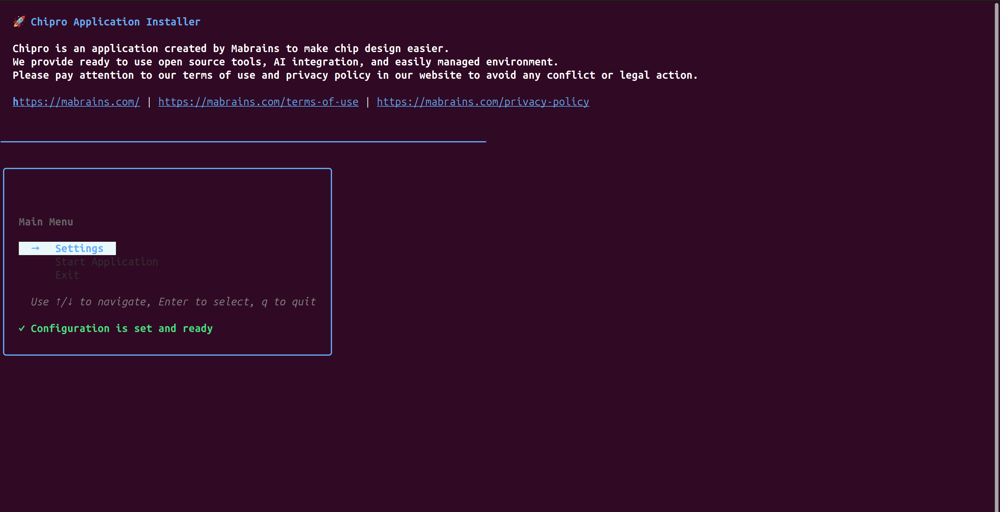
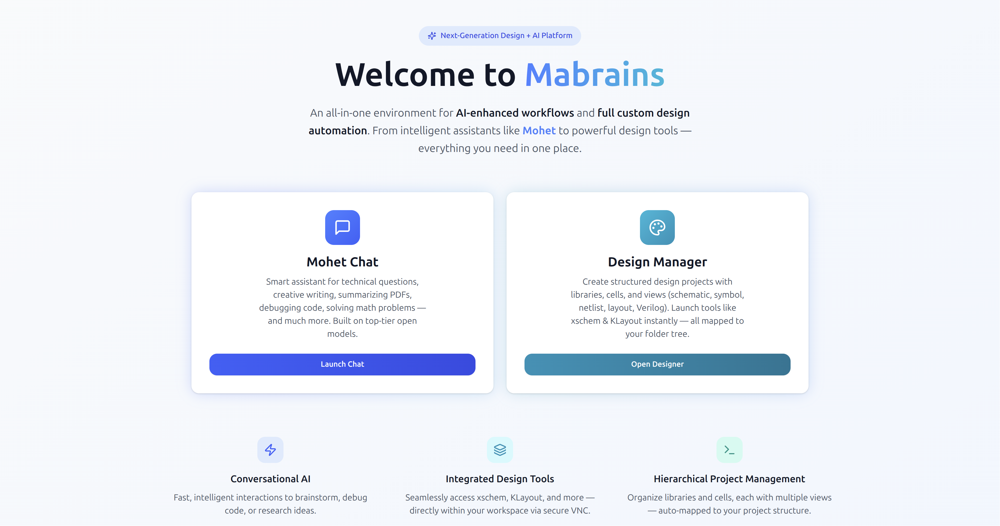
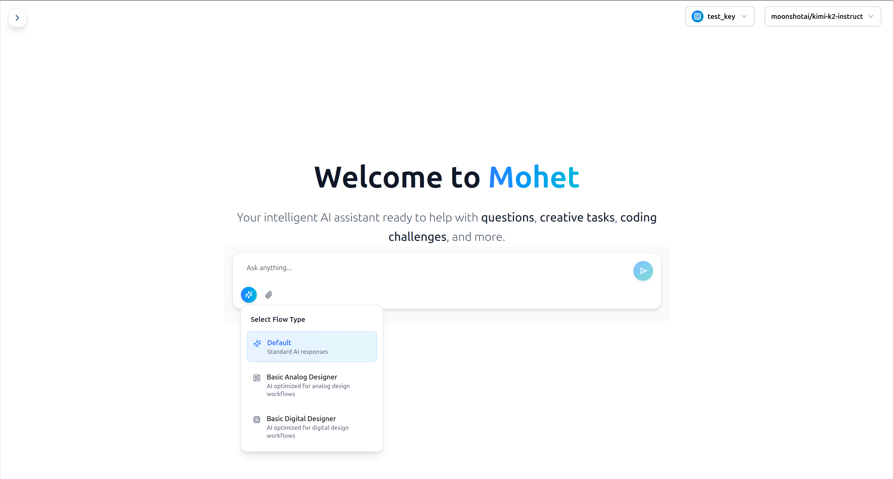
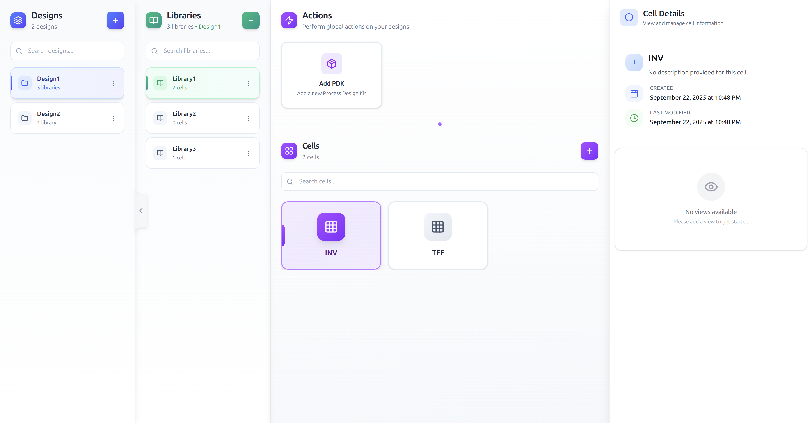
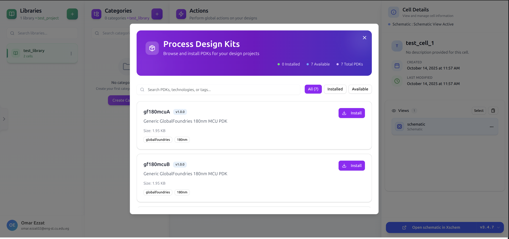
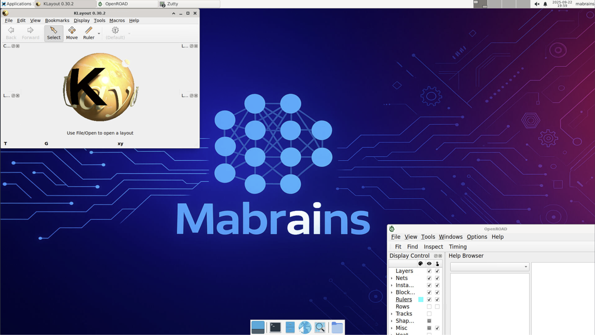
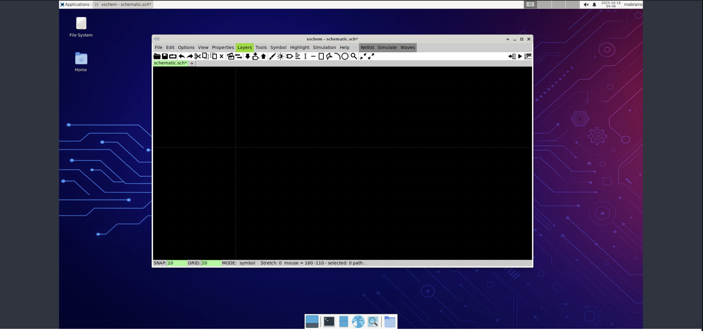

<p align="center">
  
</p>

<h1 align="center">🚀 Welcome to <strong>Chipro</strong></h1>

<p align="center">
  <strong>The All-in-One AI-Powered Chip Design Platform</strong>
</p>

<p align="center">
  <a href="#-about-chipro">About</a> •
  <a href="#installation-guide">Installation</a> •
  <a href="#-product-showcase">Showcase</a> •
</p>

---

## 🧭 About Chipro

**Chipro** is an intelligent, modular Electronic Design Automation (EDA) environment built to unify AI-assisted design with a fully automated design management system. It simplifies the entire design process with one goal in mind:

> _Streamline the chip design process to be simpler & faster then it ever was._

Chipro is composed of two powerful and complementary components:

### 🤖 1. The AI Chat Module

Your personal design assistant — an **AI-driven conversational engineer** that understands your workflow and speaks your language. It provides several specialized design “flows”:

- **🌐 General Default Flow**
  A flexible assistant for scripting, documentation, and general productivity tasks.

- **🧠 Analog Designer Flow**
  Acts as an expert analog engineer capable of:

  - Generating complex **SPICE netlists** from specifications.
  - Running **simulations** and analyzing results.
  - Providing **debugging insights** and design optimization tips.

- **💻 Digital Designer Flow**
  Focused on **digital logic and RTL design**, supporting tasks like:

  - Creating and validating **Verilog/VHDL netlists**.
  - Running synthesis and verification flows.
  - Automating digital design setup.

> Whether you're creating your next amplifier or a SoC component, the AI Chat Module acts as a virtual teammate — guiding, coding, and reasoning alongside you.

---

#### Model Providers: Cloud and Local, Seamlessly

The AI layer is provider-agnostic. You can mix and match providers per workspace, per project, or even per task:

- **Cloud providers** (for maximum performance and breadth of models)
  Supports major vendors such as **OpenAI**, **Groq**, **Mistral**, and others.

  - Benefits: state-of-the-art capability, large context windows, rapid iteration.
  - Typical use: exploratory design, heavy reasoning, large code/netlist generation, multi-turn analysis.

- **Local providers** (for privacy-sensitive workflows)
  Run models locally through **LM Studio** or **Ollama**.

  - Benefits: data never leaves your machine, predictable costs, offline capability.
  - Typical use: proprietary IP, confidential designs, air-gapped labs, continuous local testing.

**API keys & credentials**

- Keys are stored locally in your environment/config files; you can scope them per user, machine, or project.
- Per-provider usage caps and **cost guards** can be set to prevent runaway spend.

---

#### Action-Taking: How the AI Operates Inside Your Tools

Beyond chat, the AI can **act** within your environment to complete end-to-end tasks:

1. **Project-aware context**
   The assistant understands your **Project → Library → Cell → View** hierarchy. It can open the correct view, fetch relevant files (e.g., `*.spice`, `*.sch`, `*.gds`), and keep track of where generated outputs should live.

2. **Design Manager integrations (direct tool invocations)**

   - Launch **KLayout** on a specific GDS view, open **Xschem** on a schematic, or start **LibreLane** for an RTL-to-GDS run.
   - Generate/modify netlists, constraints, PDK references, and run scripts with consistent environment variables and paths.
   - Collect outputs (logs, waveforms, reports), summarize results, and propose next steps.

3. **VNC-backed interactions (full GUI control when needed)**

   - Through the built-in **VNC interface**, the AI can interact with GUI tools (click, type, menu navigation) to execute procedures not exposed via CLI/APIs.
   - This enables tasks like editing parameters in Xschem, launching DRC/LVS from KLayout menus, or stepping through custom plugin dialogs — fully **automated** or **human-in-the-loop**.

---

#### Typical End-to-End Scenarios

- **Analog flow example**

  1. You describe a spec; the AI drafts a **SPICE** netlist and places it into the project under the correct **Library/Cell/View**.
  2. It runs the simulation, gathers waveforms/logs, and summarizes key metrics (gain, bandwidth, noise).
  3. It proposes parameter sweeps or corners, executes them, and compares results against your targets — with links to artifacts and plots.

- **Digital flow example**

  1. You upload or sketch an RTL. The AI lints, runs synthesis, sets up **LibreLane**, and kicks off a pipeline with your constraints.
  2. It reports timing/area/power, suggests constraint tweaks, and can re-launch the run.
  3. It opens the resulting GDS in **KLayout** (via VNC if desired) and prepares a review checklist.

---

### 🎛️ 2. The Design Manager

The **Design Manager** is the beating heart of Chipro — your **mission control center** for managing every aspect of the electronic design workflow.
It orchestrates the tools, abstracts away configuration pain, and gives you an organized, intelligent workspace that simply works.

#### 🧩 Hierarchical Project Structure

At its core, Chi-Pro embraces a **structured design hierarchy** inspired by professional EDA environments:

- **📁 Projects**
  The top-level container representing your complete design workspace — think of it as your “chip project”.

- **🏛️ Libraries**
  Each project can contain one or more libraries, grouping related cells and design assets together.

- **🔬 Cells**
  The fundamental building blocks within a library — representing functional circuit blocks, modules, or IPs.

- **🪞 Views**
  Each cell can have multiple **views**, representing the same design from different perspectives:

  - **Schematic View** — for design intent and connectivity (opened with **Xschem**)
  - **Layout / GDS View** — for physical implementation and verification (opened with **KLayout**)
  - **Symbol View** — for schematic symbol definition and linking (opened with **VS Code**)
  - **RTL / Code View** — for logic descriptions, behavioral models, or testbenches
  - **Simulation View** — for SPICE or Verilog simulation setups
  - **LibreLane Flow View** — for automated full RTL-to-GDSII pipeline runs

This hierarchy allows you to **navigate complex designs effortlessly**, maintain clear separation between analog and digital domains, and **categorize** your libraries and cells by function, project stage, or technology node — making large designs manageable and intuitive.

> _With Chipro, your design environment feels structured, clean, and scalable._

---

#### 🧱 Unified Toolchain Access — Everything Just Works

Forget the endless hours of setup, dependency management, and tool mismatches.
The **Design Manager** is fully containerized — meaning **you don’t have to install or configure anything manually**.

- No compiling KLayout.
- No dependency chains for Xschem or LibreLane.
- No version conflicts.
- No PATH juggling.

Everything is pre-configured, tested, and integrated out of the box.

Simply click or select a view — and **the right tool launches instantly**, already linked to your project structure.
It’s that seamless.

> _Why spend days fighting setup scripts when you can start designing in minutes?_

---

#### 🗂️ Categories for Smarter Organization

Chipro also introduces **categories**, allowing you to tag and group projects or libraries or even cells.

This enables more intelligent filtering, search, and AI assistance.

---

#### 🖥️ Integrated VNC Access — Direct Interaction with Tools

The **Design Manager** provides a built-in **VNC** interface, giving you direct graphical access to all your design tools inside a fully isolated environment.

- Launch and control **KLayout**, **Xschem**, **LibreLane**, and more — all from your browser.
- Interact with your designs as if you were on a full EDA workstation.
- Zero setup, zero installation, fully interactive.

But here’s where it gets truly next-generation:

> The **AI Chat Module** can access this same VNC environment to **perform actions automatically** — running simulations, modifying layouts, or even generating new cells autonomously.

This means your AI assistant isn’t just conversational — it’s **operational**.
It can see, click, modify, and run tasks within your workspace — effectively bridging human-AI collaboration for circuit design.

---

> _The Design Manager is where structure meets simplicity.
> You don’t waste time installing tools, fixing environment variables, or chasing dependencies.
> You just design — and everything else, from the workspace to the AI automation, is handled for you._

---

## Installation Guide

The **Chipro Installer** is a sleek, terminal-based setup assistant that takes care of everything for you — no manual steps, no complex configuration.

### 📋 Prerequisites

Make sure you have one of the following container runtimes installed and running:

- [![Docker][Docker.com]][Docker-url]
- [![Podman][Podman.io]][Podman-url]

### 📦 Step 0 — Clone the Repository

Before installing, you’ll need to **clone the Chipro Installer repository** to your local machine.
This gives you access to all necessary files — including the installer script, configuration templates, and resource data.

#### 🔹 Using HTTPS

```bash
git clone https://github.com/mabrains/Chipro.git
cd Chipro
```

> **Tip:** Make sure you’re inside the `Chipro` directory before running the installer — this is where all setup scripts and environment files reside.

<p align="center">
  
</p>

Once cloned, you’re ready to move on to the next step: downloading and launching the installer.

---

### 🧩 Step 1 — Download the Installer

Grab the latest version from the [**Releases Page**](https://github.com/your-username/chipro_installer/releases).

```bash
# Example for Linux/macOS
cd  linux
chmod +x ./installer
./installer
```

or on Windows (not fully supported):

1. Open the folder corresponding to your device architecture
2. Run the `installer.exe` file

<p align="center">
  
</p>

---

### ⚙️ Step 2 — Configure Installation

You’ll be guided through an interactive setup where you’ll define:

| Parameter     | Description                                         | Example        |
| ------------- | --------------------------------------------------- | -------------- |
| **API Key**   | Your personal Chipro API key to access AI services. | `mb-123abc...` |
| **User Area** | The path to the volume of user area                 | `/home/user`   |
| **VNC Port**  | Local VNC access port for the GUI tools.            | `6080`         |
| **App Port**  | Local access port for Chipro’s main application.    | `8080`         |

> The installer automatically checks for port availability and resolves conflicts.

<p align="center">
  
</p>

---

### 🔑 How to Obtain Your API Key

Before running the installer, you’ll need a **Chipro API key** to enable access to the AI Chat Module and design automation services.

1. **Visit [Mabrains.com](https://mabrains.com)**
   Open the official Mabrains website in your browser.

2. **Create an Account**

   - Click on **Sign Up** and fill in your details.
   - Confirm your email address to activate your account.

3. **Access the API Keys Page in Your Account**

   - Once logged in, navigate to the **Dashboard → API Keys** section.
   - Click **Generate New API Key** to create your personal key.
   - Copy the key to your clipboard — it will look something like:

     ```
     mb-3ae4x8f02b1f4f09...
     ```

> **Note:** Keep your API key secure — it’s unique to your account and grants access to all integrated AI providers configured through your Chipro workspace.

---

### 🚀 Step 3 — Deploy Chipro

Once configured, the installer will:

1. Detect your container runtime (Docker or Podman).
2. Pull the latest **Chipro** image.
3. Launch all required services.
4. Display access URLs and container information.

> Within minutes, Chipro is live — no manual configuration needed.

---

### ✅ Step 4 — Verify Your Setup

Once complete, you’ll be greeted with a success summary showing:

- Container ID
- Application URL
- VNC URL
- Mapped Ports

Example output:

```bash
✔ Chipro Deployment Complete!
Container ID: 3d9a4b27c12f
App URL: http://localhost:8000
VNC URL: http://localhost:6080
```

---

## 🌟 Product Showcase

A visual journey through Chipro’s power and versatility.

|        Our Welcome Screen         |          The Chat Module           |
| :-------------------------------: | :--------------------------------: |
|  |  |

|     The Design Manager     |            PDK Installation             |
| :------------------------: | :-------------------------------------: |
|  |  |

|      KLayout Integration      |   Xschem Schematic Editing   |
| :---------------------------: | :--------------------------: |
|  |  |

## 🧠 Why Chipro?

- **AI-Driven Productivity:** The only EDA platform that learns your design style.
- **Zero Setup Hassle:** Fully containerized and automated.
- **Unified Tool Ecosystem:** All your tools, one click away.
- **Cross-Platform:** Works seamlessly across Linux, macOS, and Windows.
- **Community-Ready:** Built for collaboration, extensibility, and innovation.

---

<p align="center">
  <strong>Chipro</strong> — Designed for Engineers. Built for the Future.
</p>

[Docker.com]: https://img.shields.io/badge/Docker-2496ED?style=for-the-badge&logo=docker&logoColor=white
[Docker-url]: https://docs.docker.com/get-docker/
[Podman.io]: https://img.shields.io/badge/Podman-FC6D26?style=for-the-badge&logo=podman&logoColor=white
[Podman-url]: https://podman.io/getting-started/installation
